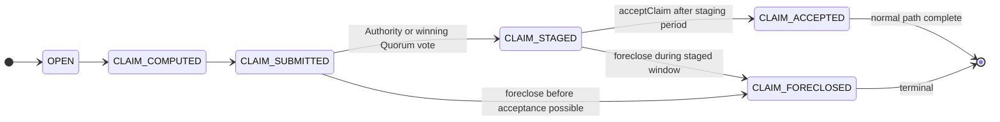

# Contracts v3 — Lifecycle Reference for QA

Condensed reference for the Rollups Node contracts v3 integration (`feature/bump-contracts-3.0`). Source material: [Contracts v3 PR presentation](../docs/presentations/contracts-v3-pr.html). For the operator narrative on *why* foreclosure exists, see [foreclose.md](../foreclose.md).

**Audience:** QA testers, cycle leads, and anyone writing catalog entries or charters for the v3 release.

---

## Version pins (update each cycle)

| Artifact | v3 target (as of branch review) |
|----------|----------------------------------|
| `rollups-contracts` | `2.2.0` → `3.0.0-alpha.6` |
| `dave` | `2.1.1` → `3.0.0-alpha.3` |
| Node branch | `feature/bump-contracts-3.0` (vs `origin/next/2.0`) |
| Generated bindings | `pkg/contracts/` refreshed |

Confirm runtime image tags in `compose.local.yaml` before executing tests. Mismatched contract suite + node binary + DB schema is the highest-risk deployment mistake.

---

## What changed (one paragraph)

Contracts v3 is not only a binding bump. Claims now move through **staging** before acceptance; each application has a **withdrawal config** and a **guardian** who can **foreclose**; after foreclosure the node enters a **second lifecycle** (prove accounts-drive root → withdraw accounts). The node became a **v3 lifecycle observer** — it must reconcile L1 events (staging, foreclosure, drive-prove, withdrawals) into explicit DB state, not only submit claims.

---

## Mental model: before vs now

### Application state

| Before (v2-alpha) | Now (v3) |
|-------------------|----------|
| Single `ApplicationState`: `ENABLED`, `DISABLED`, `FAILED`, `INOPERABLE` | **`enabled`** (operator intent) + **`status`** (system health) |
| Foreclosure hard to model | **`status=FORECLOSED`** with durable **`foreclose_block`** on L1 |
| No post-foreclosure observation model | EVM Reader keeps scanning drive-prove and withdrawal events |

**`status` values:** `OK`, `FAILED`, `INOPERABLE`, `FORECLOSED`

**Key distinction for QA:** `FORECLOSED` is a **normal emergency path**, not corruption. `INOPERABLE` means local mismatch or corruption. A healthy foreclosed app is typically `enabled=true`, `status=FORECLOSED`, `foreclose_block > 0`.

### Claim finality

| Before | Now |
|--------|-----|
| Authority/Quorum: mostly submit → accept | **SUBMITTED → STAGED → ACCEPTED** |
| No local staging model | `CLAIM_STAGED` epoch status; `staged_at_block` required |
| No withdrawal table/API | `Withdrawal` events stored; JSON-RPC read methods |

---

## Consensus paths: Authority, Quorum, PRT

### Authority

Submit and stage happen **in the same transaction**. `acceptClaim` is a **separate transaction** after `claimStagingPeriod` blocks elapse.

```
CLAIM_COMPUTED → CLAIM_SUBMITTED → CLAIM_STAGED → (wait staging period) → CLAIM_ACCEPTED
```

Early `acceptClaim` (before staging period) must revert on-chain. If the claimer was offline and returns, it should log the rejection and recover without infinite retries.

**Catalog:** [FOR-001](../catalog/track-b/foreclose.md), [break-the-claimer](../charters/break-the-claimer.md)

### Quorum

A submitted claim is **not** always staged by our transaction. The node must watch events and `getClaim` state until majority voting stages one claim, then `acceptClaim` later.

Honest vote divergence must **not** produce false `INOPERABLE`.

**Catalog:** [QUO-001](../catalog/track-b/quorum.md), [QUO-002](../catalog/track-b/quorum.md)

### PRT (Dave tournaments)

PRT **skips `CLAIM_STAGED`**. Dave tournaments can move `CLAIM_COMPUTED` → `CLAIM_ACCEPTED` directly. After foreclosure, PRT skips new tournament work and reports pre-foreclosure drain progress.

**Cycle scope:** PRT-specific paths are currently marked out of scope in several catalog files and charters. Decide explicitly in each cycle `plan.md` whether PRT is in or deferred.

---

## Epoch status machine



**DB rules:** triggers reject invalid transitions. `CLAIM_STAGED` is valid for Authority and Quorum only (not PRT).

**Foreclosure terminalizes** any non-accepted pre-foreclosure claim work as `CLAIM_FORECLOSED`. Previously accepted history must be preserved.

**Catalog:** [FOR-002](../catalog/track-b/foreclose.md) through [FOR-004](../catalog/track-b/foreclose.md)

---

## Post-foreclosure service behavior

Do **not** disable foreclosed apps automatically if you still need post-foreclosure observation.

| Service | Normal work | Foreclosed app |
|---------|-------------|----------------|
| **EVM Reader** | Scans inputs, outputs, epochs, L1 state | Records foreclosure; scans drive-prove and withdrawal events |
| **Advancer** | Runs while `enabled && status=OK && foreclose_block=0` | Keeps machine only while pre-foreclosure inputs are undrained |
| **Validator** | Computes proofs for processed epochs | Skips epochs that cannot become accepted after foreclosure block |
| **Claimer** | Submit, stage, accept Authority/Quorum claims | Read-only reconciliation; marks impossible claims `CLAIM_FORECLOSED` |
| **PRT** | Dave tournament work | Skips new tournaments; reports pre-foreclosure drain |

**EVM Reader scan order:** detect foreclosure **first**, then build scan plan (pre-foreclosure inputs → output execution → post-foreclosure drive-prove/withdrawals). Cursors (`last_foreclose_check_block`, etc.) advance strictly monotonically.

---

## Emergency withdrawal sequence

After foreclosure, normal claim submission stops. Recovery is permissionless (except guardian foreclose):

1. **Guardian** calls `foreclose()` — app becomes `FORECLOSED`; `foreclose_block` recorded.
2. **Anyone** calls `proveAccountsDriveMerkleRoot(root, proof)` — once per app.
3. **Anyone** calls `withdraw(account, accountProof)` — gas payer can differ from recipient.
4. EVM Reader stores `Withdrawal` events; JSON-RPC and CLI expose them.

Proof files come from `cartesi-rollups-machine-tool` (replay snapshot → `prove accounts-drive`).

**Catalog:** [FOR-006](../catalog/track-b/foreclose.md) through [FOR-012](../catalog/track-b/foreclose.md), [MTL-001](../catalog/track-b/machine-tool.md), [MTL-002](../catalog/track-b/machine-tool.md), [SMK-005](../catalog/track-a.md)

---

## API and CLI surface (what QA should verify)

### Application JSON (JSON-RPC / reads)

Old single `state` field replaced by:

- `enabled`, `status`
- `claim_staging_period`, `withdrawal_config`
- Foreclosure markers: `foreclose_block`, `accounts_drive_proved_block`, root, transactions, cursors

**Catalog:** [ILC-010](../catalog/track-b/internal-cli.md)

### New JSON-RPC methods

- `cartesi_listWithdrawals`
- `cartesi_getWithdrawal`

Verify operator CLI `read withdrawals` and JSON-RPC return consistent rows (FOR-012).

### New operator CLI commands

```
cartesi-rollups-cli foreclose <app>
cartesi-rollups-cli prove-drive-root <app> --proof-file drive-root-proof.json
cartesi-rollups-cli withdraw <app> --proof-file account-proof.json
cartesi-rollups-cli read withdrawals <app> [account-index]
```

Deploy support: `deploy application --claim-staging-period`, `--withdrawal-config`, `--withdrawal-config-file`; `deploy quorum` for v3 Quorum.

**Catalog:** [ILC-007](../catalog/track-b/internal-cli.md) through [ILC-010](../catalog/track-b/internal-cli.md)

---

## QA focus lanes

Test **lifecycle correctness**, not only command success. Upstream integration tests cover staging, quorum, foreclosure, replay, and withdrawal on Anvil — manual QA still matters for operator-facing tools, timing on real networks, and error clarity.

| Lane | What to test | Expected signal |
|------|--------------|-----------------|
| **Staging** | Authority: submit stages immediately; accept waits for period | `CLAIM_COMPUTED → SUBMITTED → STAGED → ACCEPTED` |
| **Quorum** | Majority stages; honest vote divergence classified correctly | No false `INOPERABLE` for pending honest divergence |
| **Foreclosure** | Foreclose before, during, and after claim work | App `FORECLOSED`; impossible claims → `CLAIM_FORECLOSED` |
| **Withdrawals** | Prove drive root, withdraw accounts, restart scanner | Rows persist once; cursors advance; RPC reads match |
| **Ops paths** | Bad signer, bad proof, bad/partial config | Clear errors; no hidden partial state |

These lanes map directly to the [cycle plan template](../templates/cycle-plan-template.md) QA Focus Lanes table.

---

## Known risk points (where bugs hurt most)

| Risk | What goes wrong | Mitigation to verify |
|------|-----------------|----------------------|
| **Chain/DB divergence** | Missed `ClaimStaged`, `ClaimAccepted`, `Foreclosure`, or `Withdrawal` event | Counters, event scans, cursors, reconciliation reads |
| **Bad withdrawal config** | Wrong guardian, drive layout, or output builder blocks recovery | All-or-nothing config validation; tool output checks |
| **Gas spending loops** | Repeated `acceptClaim` failures burn gas forever | `CARTESI_CLAIMER_MAX_ACCEPT_ATTEMPTS` (default 5); app → `FAILED` |
| **PRT assumptions** | PRT never uses `CLAIM_STAGED`; no new tournaments after foreclosure | Consensus-aware filters; DB trigger rules |

---

## Ops checklist (before v3 deploy)

### Configuration

- [ ] Update factory addresses: InputBox, AuthorityFactory, QuorumFactory, ApplicationFactory, SelfHosted, DaveAppFactory
- [ ] Set `CARTESI_CLAIMER_MAX_ACCEPT_ATTEMPTS` if default `5` is wrong for the network
- [ ] Confirm guardian wallets and withdrawal config for apps that need foreclosure
- [ ] Confirm snapshot policy for apps that may need withdrawal proofs

### Data and rollout

- [ ] Migration `000001` changed — **do not reuse a v2-alpha DB** without an explicit migration plan
- [ ] JSON-RPC clients updated for `enabled` + `status` (not old single `state`)
- [ ] Monitor `FORECLOSED`, `FAILED`, `INOPERABLE`, and claim staging states **separately**
- [ ] Guardian and gas-payer accounts funded for emergency flows

### Highest-risk mistake

Mixing **old contracts**, **old factory addresses**, or **old DB shape** with the new node binary.

---

## Catalog map (v3-heavy areas)

| Topic | Primary catalog file |
|-------|----------------------|
| Staging + foreclosure + emergency withdrawal | [catalog/track-b/foreclose.md](../catalog/track-b/foreclose.md) |
| Quorum staging/divergence | [catalog/track-b/quorum.md](../catalog/track-b/quorum.md) |
| Operator CLI v3 | [catalog/track-b/internal-cli.md](../catalog/track-b/internal-cli.md) |
| Machine tool proofs | [catalog/track-b/machine-tool.md](../catalog/track-b/machine-tool.md) |
| Release smoke (includes emergency path) | [catalog/track-a.md](../catalog/track-a.md) |
| JSON-RPC boundaries | [catalog/track-b/jsonrpc-api.md](../catalog/track-b/jsonrpc-api.md) |

---

## Upstream integration tests (do not duplicate manually)

Before adding catalog entries, check whether CI already covers the mechanics:

- `test/integration/*foreclose*.go`
- `test/integration/withdrawal_lifecycle_test.go`
- `test/integration/echo_quorum_test.go`
- `internal/repository/repotest/`

Manual value remains: real testnet timing, operator UX, cross-surface parity (CLI vs JSON-RPC), and partial-failure recovery.

---

## Related artifacts

| Artifact | Purpose |
|----------|---------|
| [v3-qa-harness.md](v3-qa-harness.md) | How to stand up the compose stack for v3 testing |
| [foreclose.md](../foreclose.md) | Narrative explanation of the emergency exit |
| [Contracts v3 PR presentation](../docs/presentations/contracts-v3-pr.html) | Full slide deck with sequence diagrams |
